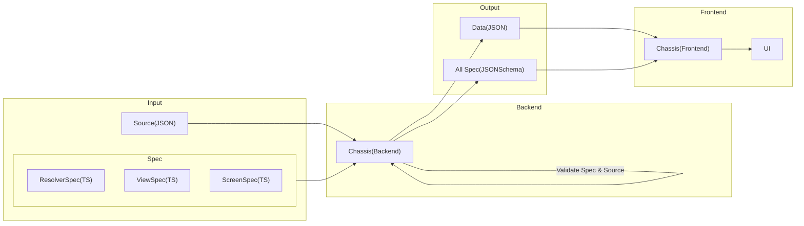

# Chassis for Backend

## Table of content

- [Overview](#overview)
- [CLI](./docs/cli.md)
- [Typescript](./docs/typescript.md)

## Overview



## What's Chassis?

Chassis helps verify the accuracy of data based on the type and specifications required by the user.

### Features

- Validate the format of the data and displays the errors found
- Command line interface that pass input data to validate or execute Chassis other commands

Users will be able to ensure that the data used to create the front-end UI is correct when validate with the chassis.

## Input(Source,Spec)

Chassis input is divided into 2 parts: the source file and the spec file.

### Source

The source file is the data that will be used to create the front-end UI in JSON format.

Example source.json :

```json
{
  "version": "1.0.0",
  "name": "default-landing-page",
  "items": [
    {
      "id": "promo_banner_super_brand_day",
      "viewType": "Banner",
      "attributes": {
        "heightPolicy": "ratio",
        "heightValue": "4:1"
      },
      "payload": {
        "type": "static",
        "data": {
          "asset": "asset.png",
          "placeholder": "placeholder.png"
        }
      }
    }
  ]
}
```

Chassis validate for objects under the field `items`. These are matched specifications by `viewType`, such as

```json
"viewType": "Banner"
```

This object uses `Banner` specifications to validate. You can read more about each field in [Data Doc](/data/README.md)

### Spec

The specifications file is a rule to validate the format of the source(JSON) in the form of a TS file.

Example ViewSpec.json :

```ts
interface Banner {
  id: string
  viewType: 'Banner'
  attributes: {
    heightPolicy: 'ratio'
    heightValue: string
  }
  payload: {
    asset: string
    placeholder: string
  }
}
```

From the above specification, `Banner` has a type of each field such as `id must be string`.If the `id` from the source(JSON) is not string, Chassis will show an error.

## Display on UI

If Chassis takes the above [Source](#Source) and [Spec](#Spec) to validate and returns true. When the front-end uses the source(JSON), it displays the banner correctly.

Example Banner :


# Getting Started

## Install

install using npm:

```
npm install chassis
```

## Usage

### Command line

...description for basic cli...

```
Usage:
...example basic cli...
```

### Programmatic use

import Chassis APIs:

```ts
import { validateSpec } from 'Chassis'
```

### Methods

- [validateSpec(specPath[],sourcePath)](<#validateSpec(specPath[],sourcePath)>)
- [getJsonSchema(json)](<#getJsonSchema(json)>)

### `validateSpec(specPath[],sourcePath)`

Call a function to validate data(JSON) with a specifications(TS).

If the function returns a value:

`TRUE` The data is valid.
`FALSE` The data is invalid and will show an error.

Example using method:

```ts
chassis.validateSpec(['path/spec/Spec1.ts', 'path/spec/Spec2.ts'], 'path/source.json')
```

output

```ts
Validate Pass!
```

### `getJsonSchema(json)`

This Method converts TS file to JsonSchema
