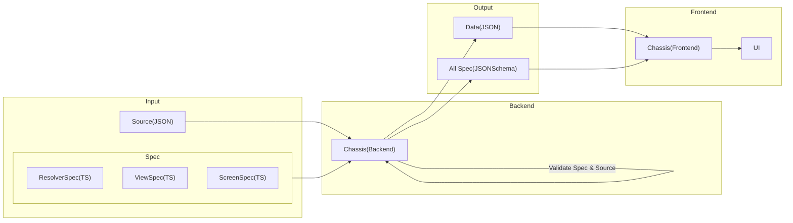

# Chassis for Backend

## Overview

```mermaid
flowchart LR
libt["Chassis(Backend)"]
libd["Chassis(Frontend)"]

subgraph Spec
    stsr["ResolverSpec(TS)"]
    stsv["ViewSpec(TS)"]
    stss["ScreenSpec(TS)"]
end

subgraph Input
    Spec
    s["Source(JSON)"]
end

subgraph Output
    output["Data(JSON)"]
    sdart["All Spec(JSONSchema)"]
end

subgraph Backend
   Spec --> libt
   s --> libt
end

libt --Validate Spec & Source--> libt
libt --> output
libt --> sdart
output --> libd 
sdart --> libd

subgraph Frontend
libd --> UI
end
```