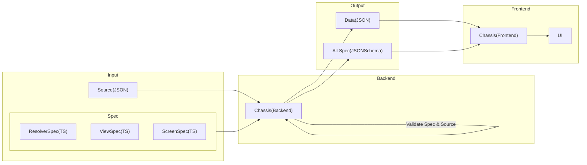

# Chassis for Backend

## Table of content

- [Overview](#overview)
- [CLI](./docs/cli.md)
- [Typescript](./docs/typescript.md)

## Overview



## What's Chassis?

Chassis helps verify the accuracy of source based on the type and specifications required by the user.

### Features

- Validate the format of the source and displays the errors found
- Command line interface that passes input source to validate or execute Chassis other commands

Users can ensure that the source used to create the front-end UI is correct when validated with Chassis.

## Input(Source,Spec)

Chassis input is divided into two parts: the source and spec files.

### Source

The source file is the data that will be used to create the front-end UI in JSON format.

Example source.json :

```json
{
  "version": "1.0.0",
  "name": "default-landing-page",
  "items": [
    {
      "id": "promo_banner_super_brand_day",
      "viewType": "Banner",
      "attributes": {
        "heightPolicy": "ratio",
        "heightValue": "4:1"
      },
      "payload": {
        "type": "static",
        "data": {
          "asset": "asset.png",
          "placeholder": "placeholder.png"
        }
      }
    }
  ]
}
```

Chassis validate for objects under the field `items`. These are matched specifications by `viewType`, such as

```json
"viewType": "Banner"
```

This object uses `Banner` specifications to validate. You can read more about each field in [Data Doc](./data/README.md)

### Spec

The specification file is a TS file for validating the source format (JSON).

Example ViewSpec.ts :

```ts
interface Banner {
  id: string
  viewType: 'Banner'
  attributes: {
    heightPolicy: 'ratio'
    heightValue: string
  }
  payload: {
    asset: string
    placeholder: string
  }
}
```

From the above specification, `Banner` has a type of each field, such as `id must be a string`. If the `id` from the source(JSON) is not a string, Chassis will show an error.

## Display on UI

When Chassis uses the [Source](#Source) and [Spec](#Spec) above to validate and return True, the front end uses the source (JSON) to render the `Banner` correctly.

Example Banner :


# Getting Started

## Install

install using npm:

```
npm install chassis
```

## Usage

### Command line

...description for basic cli...

```
Usage:
...example basic cli...
```

### Programmatic use

Import Chassis APIs method:

```ts
import { validateSpec } from 'Chassis'
```

### Methods

- [validateSpec(specPath[],sourcePath)](<#`validateSpec(specPath[],sourcePath)`>)
- [getJsonSchema(jsonPath)](<#`getJsonSchema(jsonPath)`>)

### `validateSpec(specPath[],sourcePath)`

Call a function to validate the source(JSON) with specifications(TS).

Example using method:

```ts
validateSpec(['path/spec/Spec1.ts', 'path/spec/Spec2.ts'], 'path/source.json')
```

If the function returns a value:

`TRUE` output is a valid source

```bash
Validate Pass!
```

`FALSE` output is an invalid source and will show an error.

```bash
Validate Failed :
Error: [
  {
    "instancePath": "/asset",
    "schemaPath": "#/properties/asset/type",
    "keyword": "type",
    "params": {
      "type": "string"
    },
    "message": "must be string"
  }
]
```

The error shows that the asset value must be of type string only.

### `getJsonSchema(jsonPath)`

This method converts the TS file to JsonSchema.

Example using method:

Banner.ts

```ts
interface Banner {
  id: string
  viewType: 'Banner'
  attributes: {
    heightPolicy: 'ratio'
    heightValue: string
  }
  payload: {
    asset: string
    placeholder: string
  }
}
```

Call a function using a `Banner.ts` as an example TS file to convert it to a schema.

```ts
getJsonSchema('path/spec/Banner.ts')
```

Output JsonSchema for `Banner`:

```bash
{
  type: 'object',
  properties: {
    id: { type: 'string' },
    viewType: { type: 'string', enum: [Array] },
    attributes: { type: 'object', properties: [Object], required: [Array] },
    payload: { type: 'object', properties: [Object], required: [Array] }
  },
  required: [ 'attributes', 'id', 'payload', 'viewType' ],
  '$schema': 'http://json-schema.org/draft-07/schema#'
}
```
