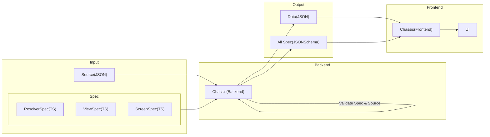

# Chassis for Backend

## Table of content

- [Overview](#overview)
- [CLI](./docs/cli.md)
- [Typescript](./docs/typescript.md)

## Overview



## What's Chassis?

Chassis helps verify the accuracy of data based on the type and specifications required by the user.

### Features

- Validate the format of the data and displays the errors found
- Command line interface that pass input data to validate or execute Chassis other commands

Users will be able to ensure that the data used to create the front-end UI is correct when validate with the chassis.

## Install

install using npm:

```
npm install chassis
```
