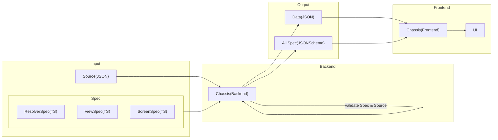

# Chassis for Backend

## Table of content

- [Overview](#overview)
- [CLI](./docs/cli.md)
- [Programmatic](./docs/Programmatic.md)

## Overview



## What's Chassis?

Chassis helps validate the accuracy of the source based on the specifications required by the user.

### Features

- Validate the format of the source and displays the errors found
- Command line interface that passes input source to validate or execute Chassis other commands

Users can ensure that the source used to create the front-end UI is correct when validated with Chassis.

## Input(Spec,Source)

Chassis input is divided into two parts: the spec and source files.

### Display on UI

Example Banner :


When Chassis uses the [Spec](#Spec) and [Source](#Source) to validate and return `TRUE`, the front end uses the source (JSON) to render the `Banner` correctly.

### Spec

The specification file is a TS file for validating the source format (JSON).

```ts
// ViewSpec.ts
interface Banner {
  id: string
  viewType: 'Banner'
  attributes: {
    heightPolicy: 'ratio'
    heightValue: string
  }
  parameter: {
    title: string
  }
  payload: {
    asset: string
    placeholder: string
  }
}
```

`Banner` has a type of each field, such as `id must be a string`. If the `id` from the source(JSON) is not a string, Chassis will show an error.

### Source

The source file is the data that will be used to create the front-end UI in JSON format.

Example source.json

```json
{
  "version": "1.0.0",
  "name": "default-landing-page",
  "items": [
    {
      "id": "promo_banner_super_brand_day",
      "viewType": "Banner",
      "attributes": {
        "heightPolicy": "ratio",
        "heightValue": "4:1"
      },
      "parameter": {
        "title": "Special for you"
      },
      "payload": {
        "type": "static",
        "data": {
          "asset": "asset.png",
          "placeholder": "placeholder.png"
        }
      }
    }
  ]
}
```

Chassis validate for objects under the field `items`. These are matched specifications by `viewType`, such as

```json
"viewType": "Banner"
```

This object uses `Banner` specifications to validate. You can read more about each field in [Data Doc](./data/README.md)

## Problem

Payload value may need resolving, `static` or `remote`. Normal specs can't validate `remote` type.

```ts
// source.json
{
  "id": "promo_banner_mid_month",
  "viewType": "Banner",
  "attributes": {
    "heightPolicy": "ratio",
    "heightValue": "4:1",
  },
  "parameter":{
    "title":"Best Seller"
  }
  "payload": {
    "type": "remote",
    "resolvedWith": "GetBanner",
      "input": {
        "slug": "best-seller"
      }
  }
}
```

The `remote` payload type does not have the `assets` and `placeholder` fields to validate with `Banner` specifications, but it has an `resolvedWith` field to handle with the resolver spec file.

## Solution

### Resolver

Chassis doesn't just manage static values. Dynamic values can be manipulated with `Resolver`.

Chassis enables the user to add a file input `resolver` specification for validating input and output by mapping spec with `resolverWith` field.

```json
"resolvedWith": "GetBanner"
```

```ts
// ResolverSpec.ts
interface GetBanner {
  input: {
    slug: string
  }
  output: {
    asset: string
    placeholder: string
  }
}
```

```ts
// ViewSpec.ts
interface Banner {
  id: string
  viewType: 'Banner'
  attributes: {
    heightPolicy: 'ratio'
    heightValue: string
  }
  parameter: {
    title: string
  }
  payload: {
    asset: string
    placeholder: string
  }
}
```

Resolver specification will define the type of output, either asset or placeholder, to validate with the payload in the Banner specification.

# Getting Started

## Install [Inprogress]

install using npm:

```sh
npm install chassis
```

## Usage

### Command line

Chassis provides access to method through the command line interface (CLI).

Example CLI for validation source by specification.

```sh
chassis validate -- --source 'path/source.json' --spec 'path/source/spec.ts'
```

### CLI Features

- validateSpec
- getJsonSchemaBySymbol
- generateJsonSchemaBySymbol
- generateJsonSchema

Details about operation and parameters of other CLI features can be read in [CLI](./docs/cli.md).

### Programmatic use

Import Chassis APIs method:

```ts
import Chassis from 'chassis'

const chassis = new Chassis([resolve(__dirname, 'path/spec/Spec1.ts'), resolve(__dirname, 'path/spec/Spec2.ts')])
```

### Methods

- [validateSpec(specPath[],sourcePath)](#validatespecspecpathsourcepath)
- [getJsonSchemaBySymbol(symbol)](#getJsonSchemaBySymbolsymbol)

### `validateSpec(specPath[],sourcePath)`

Call a function to validate the source(JSON) with specifications(TS).

Example using method:

```ts
// Valdiate Spec
await chassis.validateSpec(resolve(__dirname, 'path/source.json'))
```

If the function returns a value:

`TRUE` output is a valid source

```bash
Validate Pass!
```

`FALSE` output is an invalid source and will show an error.

```bash
Validate Failed :
Error: [
  {
    "instancePath": "/asset",
    "schemaPath": "#/properties/asset/type",
    "keyword": "type",
    "params": {
      "type": "string"
    },
    "message": "must be string"
  }
]
```

The error shows that the asset value type must be string only.

### `getJsonSchemaBySymbol(symbol)`

This method converts the TS file to JsonSchema.

Example using method:

```ts
// Banner.ts
interface Banner {
  id: string
  viewType: 'Banner'
  attributes: {
    heightPolicy: 'ratio'
    heightValue: string
  }
  parameter: {
    title: string
  }
  payload: {
    asset: string
    placeholder: string
  }
}
```

Call a function using a `Banner.ts` as an example TS file to convert to a schema.

```ts
// Get json schema by symbol
await chassis.getJsonSchemaBySymbol('Banner')
```

Output JsonSchema for `Banner`:

```bash
{
  "type": "object",
  "properties": {
    "id": {
      "type": "string"
    },
    "viewType": {
      "type": "string",
      "enum": [
        "Banner"
      ]
    },
    "attributes": {
      "type": "object",
      "properties": {
        "heightPolicy": {
          "type": "string",
          "enum": [
            "ratio"
          ]
        },
        "heightValue": {
          "type": "string"
        }
      },
      "required": [
        "heightPolicy",
        "heightValue"
      ]
    },
    "parameter": {
      "type": "object",
      "properties": {
        "title": {
          "type": "string"
        }
      },
      "required": [
        "title"
      ]
    },
    "payload": {
      "type": "object",
      "properties": {
        "asset": {
          "type": "string"
        },
        "placeholder": {
          "type": "string"
        }
      },
      "required": [
        "asset",
        "placeholder"
      ]
    },
    "parameters": {}
  },
  "required": [
    "attributes",
    "id",
    "parameter",
    "payload",
    "viewType"
  ],
  "$schema": "http://json-schema.org/draft-07/schema#"
}
```

# Improve

- Handle error output

# Working

- Test case
- Doc
