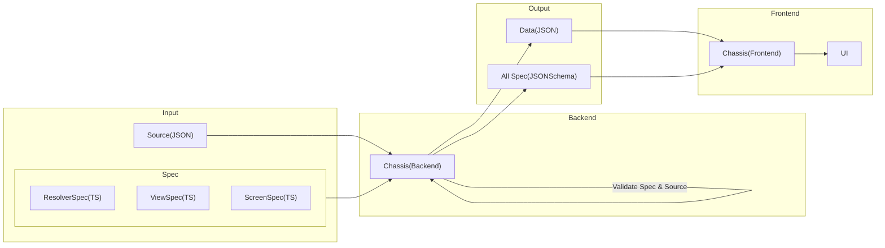

# Chassis for Backend

## Table of content

- [Overview](#overview)
- [CLI](./docs/cli.md)
- [Programmatic](./docs/programmatic.md)

## Overview



## What's Chassis?

Chassis helps validate the accuracy of the source, based on the specifications required by the user.

### Features

- The source's format is validated, and any errors found are displayed.
- The command line interface passes the input source to validate or execute other Chassis commands.

Chassis allows users to validate the source used for creating the front-end UI, ensuring its accuracy.

## Input(Spec,Source)

Chassis input is comprised of two components: specification and source files.

### Display on UI

Example Banner :


Chassis validation of the front-end UI is based on the [Spec](#Spec) and [Source](#Source) files. If the validation returns `TRUE`, the front end will correctly render the `Banner` using the source in JSON format.

### Spec

The specification file validates the source format (JSON) as a TypeScript file.

```ts
// ViewSpec.ts
interface Banner extends ChassisViewSpec {
  id: string
  viewType: 'Banner'
  payload: {
    asset: string
    placeholder: string
  }
}
```

`Banner` fields, like `id`, must be specific data types. Chassis displays error if source `id` (in JSON) is not a `string`.

### Source

The source file is JSON data used to create the front-end UI.

source.json

```json
{
  "version": "1.0.0",
  "name": "default-landing-page",
  "items": [
    {
      "id": "promo_banner_super_brand_day",
      "viewType": "Banner",
      "attributes": {
        "heightPolicy": "ratio",
        "heightValue": "4:1"
      },
      "parameter": {
        "title": "Special for you"
      },
      "payload": {
        "type": "static",
        "data": {
          "asset": "asset.png",
          "placeholder": "placeholder.png"
        }
      }
    }
  ]
}
```

This object uses `Banner` specifications to validate. You can read more about each field in [Data Doc](./data/README.md)

## Problem

Payload value may need resolving, `static` or `remote`. Normal specs can't validate `remote` type.

source.json

```json
{
  "id": "promo_banner_mid_month",
  "viewType": "Banner",
  "attributes": {
    "heightPolicy": "ratio",
    "heightValue": "4:1",
  },
  "parameter":{
    "title":"Best Seller"
  }
  "payload": {
    "type": "remote",
    "resolvedWith": "GetBanner",
      "input": {
        "slug": "best-seller"
      }
  }
}
```

The `remote` payload type does not have the `assets` and `placeholder` fields to validate with `Banner` specifications, but it has an `resolvedWith` field to handle with the resolver spec file.

## Solution

### Resolver

Chassis handles dynamic values through the use of `Resolver`. It allows the user to specify a resolver specification file for input/output validation by mapping the spec to the `resolvedWith` field.

```json
"resolvedWith": "GetBanner"
```

```ts
// ResolverSpec.ts
interface GetBanner {
  input: {
    slug: string
  }
  output: {
    asset: string
    placeholder: string
  }
}
```

```ts
// ViewSpec.ts
interface Banner {
  id: string
  viewType: 'Banner'
  attributes: {
    heightPolicy: 'ratio'
    heightValue: string
  }
  parameter: {
    title: string
  }
  payload: {
    asset: string
    placeholder: string
  }
}
```

Resolver spec defines output type (asset or placeholder) to validate with payload in Banner spec.

# Getting Started

## Install [Inprogress]

install using npm:

```sh
npm install chassis
```

## Usage

### `validateSpec`

Invoke a function to validate the source represented in JSON format against the specifications defined in TypeScript.

Example CLI:

```sh
npm run cli validate -- --source 'path/source.json' --spec 'path/ViewSpec.ts','path/ResolverSpec.ts'
```

Example method:

```ts
import Chassis from 'chassis'

const chassis = new Chassis([resolve(__dirname, 'path/spec/Spec1.ts'), resolve(__dirname, 'path/spec/Spec2.ts')])
// Valdiate Spec
await chassis.validateSpec(resolve(__dirname, 'path/source.json'))
```

If the function returns a value:

`TRUE` output is a valid source

```bash
Validate Pass!
```

`FALSE` output is an invalid source and will show an error.

```bash
Validate Failed :
Error: [
  {
    "instancePath": "/asset",
    "schemaPath": "#/properties/asset/type",
    "keyword": "type",
    "params": {
      "type": "string"
    },
    "message": "must be string"
  }
]
```

Error indicates asset value must be of type string only.

### [Inprogress] `getJsonSchemaBySymbol`

This method transforms a TypeScript file into a JSON Schema.

Example method:

```ts
// Banner.ts
interface Banner {
  id: string
  viewType: 'Banner'
  attributes: {
    heightPolicy: 'ratio'
    heightValue: string
  }
  parameter: {
    title: string
  }
  payload: {
    asset: string
    placeholder: string
  }
}
```

Invoke a function using Banner.ts as a sample TypeScript file to be transformed into a JSON schema.

```ts
import Chassis from 'chassis'

const chassis = new Chassis([resolve(__dirname, 'path/spec/Spec1.ts'), resolve(__dirname, 'path/spec/Spec2.ts')])

// Get json schema by symbol
await chassis.getJsonSchemaBySymbol('Banner')
```

Output JsonSchema for `Banner`:

```bash
{
  "type": "object",
  "properties": {
    "id": {
      "type": "string"
    },
    "viewType": {
      "type": "string",
      "enum": [
        "Banner"
      ]
    },
    "attributes": {
      "type": "object",
      "properties": {
        "heightPolicy": {
          "type": "string",
          "enum": [
            "ratio"
          ]
        },
        "heightValue": {
          "type": "string"
        }
      },
      "required": [
        "heightPolicy",
        "heightValue"
      ]
    },
    "parameter": {
      "type": "object",
      "properties": {
        "title": {
          "type": "string"
        }
      },
      "required": [
        "title"
      ]
    },
    "payload": {
      "type": "object",
      "properties": {
        "asset": {
          "type": "string"
        },
        "placeholder": {
          "type": "string"
        }
      },
      "required": [
        "asset",
        "placeholder"
      ]
    },
    "parameters": {}
  },
  "required": [
    "attributes",
    "id",
    "parameter",
    "payload",
    "viewType"
  ],
  "$schema": "http://json-schema.org/draft-07/schema#"
}
```

### [Inprogress]`generateJsonSchemaBySymbol`

### [Inprogress]`generateJsonSchema`

# Working

- programmatic
- CLI
- Handle error output
- Test case
- Doc
