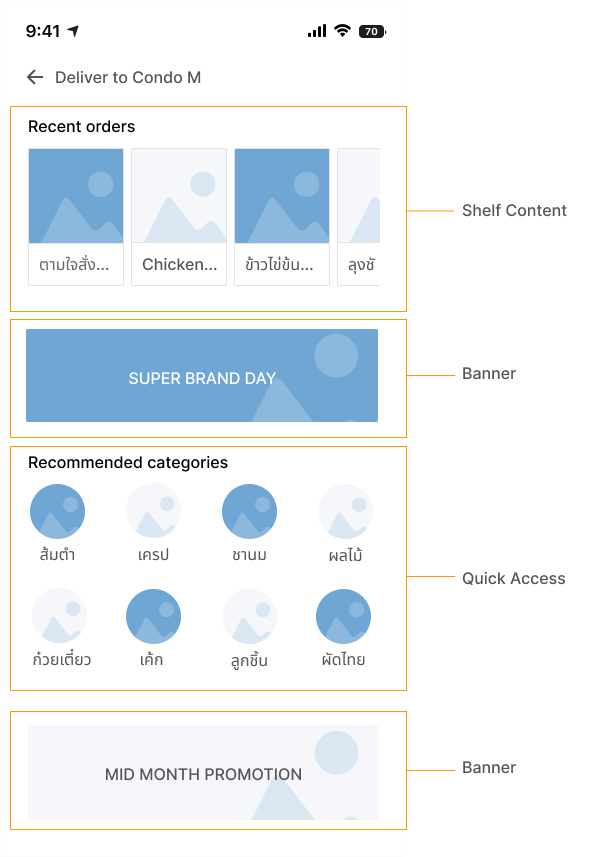
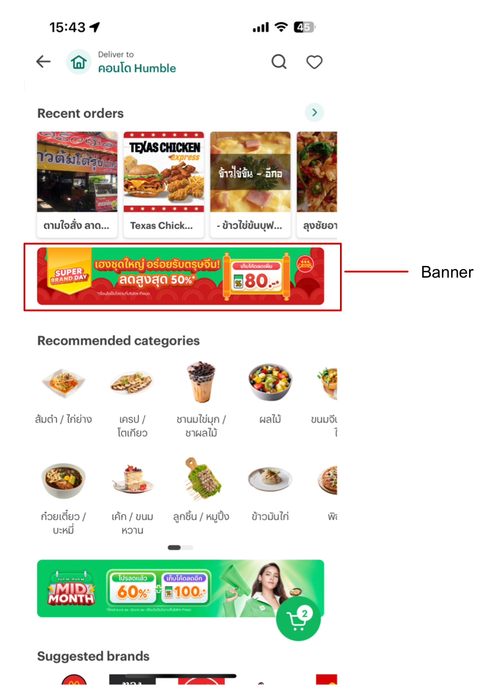

# Chassis for Backend

Chassis helps validate the accuracy of the source, based on the specifications required by the user.

- [Chassis for Backend](#chassis-for-backend)
- [Overview](#overview)
  - [Input](#input)
  - [Backend](#backend)
  - [Frontend](#frontend)
- [Key Features](#key-features)
- [Installation](#installation)
- [Usage Examples](#usage-examples)
  - [CLI Usage](#cli-usage)
  - [API Reference](#api-reference)
- [Tutorials](#tutorials)
  - [Step-by-Step Guide to Creating a UI in Chassis](#step-by-step-guide-to-creating-a-ui-in-chassis)

## Overview

The purpose of a Chassis is to verify the accuracy of the source code used to create the front-end user interface.


This is a flowchart that describes the process of how the Chassis Backend and Frontend interact with each other.

### Input

The Chassis Backend takes as input the `ResolverSpec`, `ViewSpec`, and `ScreenSpec` written in TypeScript, as well as the `Source` data in JSON format.

Read more about the input in the documentation.

- [Spec](./docs/spec.md)
- [Source](./docs/source.md)

### Backend

The Chassis Backend verifies the accuracy of the `Spec` and `Source`, and returns the output `Source` in a validated JSON format, as well as the `All Spec` file in the JSON Schema format.

### Frontend

The Chassis Frontend receives the output `Source` and `All Spec` from the Chassis Backend, and uses this data to generate the user interface (UI).

### Example UI



## Key Features

- Source Validation
- Get Specification Schema by Symbol
- Generate Specification Schema File by Symbol
- Generate Specification All Schema File

## Installation

install using npm:

```sh
npm install chassis
```

## Usage Examples

Chassis is a tool for validating data. It provides examples and usage guidelines to help users understand how to use the library.

The library can be used via the command line interface (CLI) or as an API.

### CLI Usage

CLI allows validation of data through execution of a command:

```sh
chassis validate --source 'path/source.json' --spec 'path/spec/Spec1.ts','path/spec/Spec2.ts'
```

With the CLI, you can validate data by specifying the path to the `source` data in JSON format and the paths to the `ResolverSpec`, `ViewSpec`, and `ScreenSpec` files in TypeScript format.

More about other CLI commands can be read in the [CLI](./docs/cli.md).

### API Reference

Here's an example of API usage:

```ts
import Chassis from 'chassis'

const chassis = new Chassis([resolve(__dirname, 'path/spec/Spec1.ts'), resolve(__dirname, 'path/spec/Spec2.ts')])
// Valdiate Spec
await chassis.validateSpec(resolve(__dirname, 'path/source.json'))
```

The API of Chassis enables programmatic data validation by importing the library, creating an instance with the spec files, and calling the `validateSpec` method with the `source` data's JSON path.

You can read more about other programmatic features in the [API](./docs/api.md).

## Tutorials

You can follow the example of using the basic library in the [Example](./example/src/index.ts).

### Step-by-Step Guide to Creating a UI in Chassis:

Example Banner :



1. In creating a UI component specification, you define a `specification file` that validates the source JSON, as a `TypeScript` file. For example, the [ViewSpec](./example/src/ViewSpec.ts) file includes a `Banner` that defines the properties of a banner component.

```ts
// ViewSpec.ts
interface Banner extends ChassisViewSpec {
  id: string
  viewType: 'Banner'
  payload: {
    asset: string
    placeholder: string
  }
}
```

The `Banner` extends `ChassisViewSpec`, which provides `base` properties for the component.

### Guide

For guidance on creating other view component specification files, refer to the [ChassisViewSpec](./docs/spec.md/#chassis-view-spec) definition in the file documentation.

2. Create a `source file` that is the JSON data used to create the front-end UI. The source file uses the Banner specification to validate the data. For example [Source](./example/source.json) file:

```json
{
  "version": "1.0.0",
  "name": "default-landing-page",
  "items": [
    {
      "id": "promo_banner_mid_year",
      "viewType": "Banner",
      "attributes": {
        "heightPolicy": "ratio",
        "heightValue": "4:1",
        "color": "red"
      },
      "payload": {
        "type": "static",
        "data": {
          "asset": "asset.png",
          "placeholder": "lalala.png"
        }
      }
    },
    {
      "id": "promo_banner_mid_month",
      "viewType": "Banner",
      "attributes": {
        "heightPolicy": "ratio",
        "heightValue": "4:1",
        "color": "red"
      },
      "payload": {
        "type": "remote",
        "resolvedWith": "GetBanner",
        "input": {
          "slug": "best-seller"
        }
      }
    }
  ]
}
```

3. If the payload value requires resolving, such as with a `remote` type,create a resolver specification file to handle the `dynamic` values.

For example,the `resolvedWith` field in the `source` file:

```json
"resolvedWith": "GetBanner"
```

Let's create this file for validation [ResolverSpec](./example/src/ResolverSpec.ts).

```ts
// ResolverSpec.ts
interface GetBanner extends ChassisResolverSpec {
  input: {
    slug: string
  }
  output: {
    asset: string
    placeholder: string
  }
}
```

The `GetBanner` extends `ChassisResolverSpec`, which provides `base` properties for the resolver.

### Guide

You can read more about what each type of payload means in the [Payload](./docs/source.md/#payload-and-resolver) and detailed guidelines for creating other resolver specs in the [ResolverSpec](./docs/spec.md/#chassis-resolver-spec).

4. Run [Chassis validation](#usage-examples) on the front-end UI using the `Spec` and `Source` files. If the validation returns `TRUE`, the front-end will correctly render the UI using the source in JSON format.

Note: The above is just an example and the actual process may vary based on the specific requirements and implementation of Chassis.
