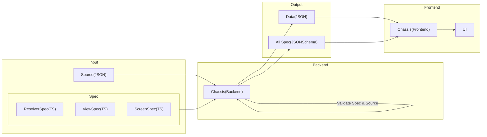

# Chassis for Backend

Chassis helps validate the accuracy of the source, based on the specifications required by the user.

## Overview

The purpose of a Chassis is to verify the accuracy of the source code used to create the front-end user interface.



This is a flowchart that describes the process of how the Chassis Backend and Frontend interact with each other.

### Input

The Chassis Backend takes as input the ResolverSpec, ViewSpec, and ScreenSpec written in TypeScript, as well as the Source data in JSON format.

Read more about the input in the documentation.

- [Spec](./docs/spec.md)
- [Source](./docs/source.md)

### Backend

The Chassis Backend verifies the accuracy of the `Spec` and `Source`, and returns the `output data` in a validated JSON format, as well as the `all spec` file in the JSON Schema format.

### Frontend

The Chassis Frontend receives the `output data` and `all spec` from the Chassis Backend, and uses this information to generate the user interface (UI).

## Key Features

- Validate
- Get Specification Schema by Symbol
- Generate Specification Schema File by Symbol
- Generate Specification All Schema File

## Installation

install using npm:

```sh
npm install chassis
```

## Usage Examples

Chassis is a tool for validating data. It provides examples and usage guidelines to help users understand how to use the library.

The library can be used via the command line interface (CLI) or as an API.

### CLI Usage

CLI allows validation of data through execution of a command:

```sh
chassis validate --source 'path/source.json' --spec 'path/spec/Spec1.ts','path/spec/Spec2.ts'
```

With the CLI, you can validate data by specifying the path to the `source` data in JSON format and the paths to the `ResolverSpec`, `ViewSpec`, and `ScreenSpec` files in TypeScript format.

More about other CLI commands can be read in the [CLI](./docs/cli.md).

### API Reference

Here's an example of API usage:

```ts
import Chassis from 'chassis'

const chassis = new Chassis([resolve(__dirname, 'path/spec/Spec1.ts'), resolve(__dirname, 'path/spec/Spec2.ts')])
// Valdiate Spec
await chassis.validateSpec(resolve(__dirname, 'path/source.json'))
```

The API of Chassis enables programmatic data validation by importing the library, creating an instance with the spec files, and calling the `validateSpec` method with the `source` data's JSON path.

You can read more about other programmatic features in the [API](./docs/programmatic.md).

## Tutorials

## Common Questions
