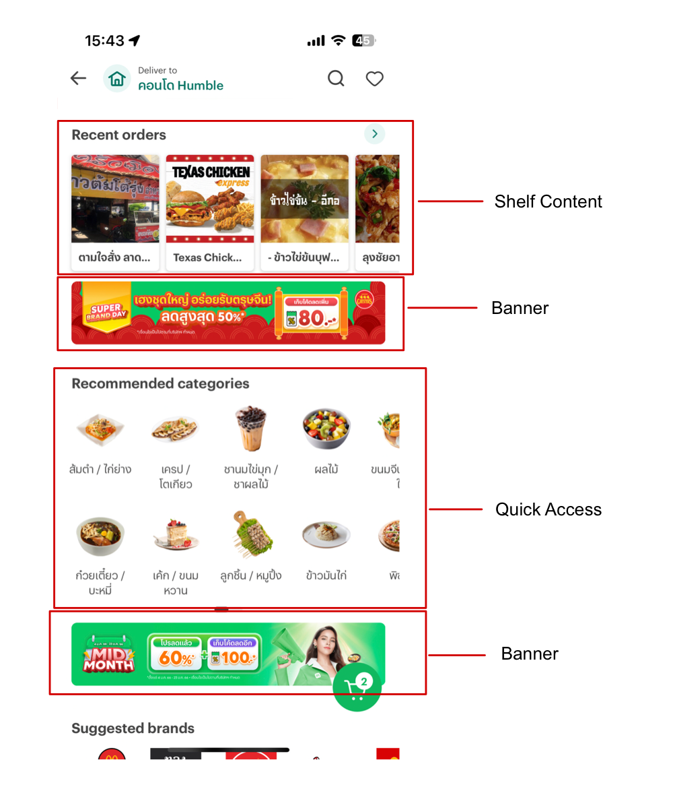

# SOURCE/OUTPUT JSON

### Default field

| Field                   | Mendatory |                                      Description                                       |
| ----------------------- | :-------: | :------------------------------------------------------------------------------------: |
| id                      |     Y     |                                    ID of each item                                     |
| viewType                |     Y     | Component view type [Banner, Quick Access, Shelf Content, Search Bar, Feed Content...] |
| attributes              |     Y     |                  The field used to define the style of the component                   |
| attributes.heightPolicy |     Y     |                           View height type [ fixed , ratio ]                           |
| attributes.heightValue  |     Y     |                                   View height value                                    |
| parameters              |           |                           The field used to display directly                           |
| payload                 |           |   Data payloads that may need to be resolve (can be known by type static or remote)    |

**Example JSON**

```json
{
  "version": "1.0.0",
  "name": "default-landing-page",
  "items": [
    {
      "id": "recent_orders_shelf_content",
      "viewType": "ShelfContent",
      "attributes": {
        "heightPolicy": "fixed",
        "heightValue": "100",
        "color": "red"
      },
      "parameters": {
        "title": "Recent orders"
      },
      "payload": {
        "type": "static",
        "data": {
          "item": [
            {
              "title": "ตามใจสั่ง ลาดพร้าว48",
              "asset": "thai-restaurant-001.png"
            },
            {
              "title": "Texas Chicken",
              "asset": "texas-chicken.png"
            }
          ]
        }
      }
    },
    {
      "id": "quick_access_menu",
      "viewType": "QuickAccess",
      "attributes": {
        "heightPolicy": "fixed",
        "heightValue": "200"
      },
      "parameters": {
        "title": "Recommended categories"
      },
      "payload": {
        "type": "static",
        "data": {
          "item": [
            {
              "title": "ส้มตำ / ไก่ย่าง",
              "asset": "food-icon-001.png"
            },
            {
              "title": "เครป / โตเกียว",
              "asset": "food-icon-002.png"
            }
          ]
        }
      }
    },
    {
      "id": "promo_banner_mid_month",
      "viewType": "Banner",
      "attributes": {
        "heightPolicy": "ratio",
        "heightValue": "4:1",
        "color": "red"
      },
      "payload": {
        "type": "remote",
        "resolvedWith": "GetBanner",
        "input": {
          "slug": "best-seller"
        }
      }
    },
    {
      "id": "promo_banner_mid_year",
      "viewType": "Banner",
      "attributes": {
        "heightPolicy": "ratio",
        "heightValue": "4:1",
        "color": "red"
      },
      "payload": {
        "type": "static",
        "data": {
          "asset": "asset.png",
          "placeholder": "lalala.png"
        }
      }
    },
    {
      "id": "quick_access_product",
      "viewType": "QuickAccess",
      "attributes": {
        "heightPolicy": "fixed",
        "heightValue": "200"
      },
      "parameters": {
        "title": "Recommended product"
      },
      "payload": {
        "type": "remote",
        "resolvedWith": "GetQuickAccessItem"
      }
    }
  ]

}
```

### Example UI


