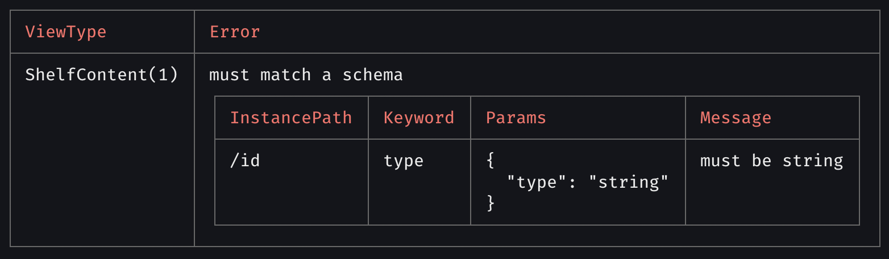

# API for Chassis

- [API for Chassis](#api-for-chassis)
- [Defined instance chassis](#defined-instance-chassis)
- [Validate](#validate)
  - [Parameters](#parameters)
  - [Usage](#usage)
  - [Output](#output)
- [Generate Specification Schema File by Symbol](#generate-specification-schema-file-by-symbol)
  - [Parameters](#parameters-1)
  - [Usage](#usage-1)
  - [Output](#output-1)
- [Generate Specification All Schema File](#generate-specification-all-schema-file)
  - [Parameters](#parameters-2)
  - [Usage](#usage-2)
  - [Output](#output-2)

## Defined instance chassis

```ts
import Chassis from 'chassis'

const chassis = new Chassis([resolve(__dirname, 'path/spec/Spec1.ts'), resolve(__dirname, 'path/spec/Spec2.ts')])
```

## Validate

This function allows you to validate a JSON file against a set of specification files.

### Parameters

```sh
1. JsonOrSourcePath: object | string
```

### Usage

```ts
await chassis.validateSpec({
  {
    "version": "1.0.0",
    "name": "default-landing-page",
    "items": [
      {
        "id": "promo_banner_mid_month",
        "viewType": "Banner",
        "attributes": {
          "heightPolicy": "ratio",
          "heightValue": "4:1",
          "color": "red"
        },
        "payload": {
          "type": "remote",
          "resolvedWith": "GetBanners",
          "input": {
            "slug": "best-seller"
          }
        }
      }
    ]
  }
})
```

```ts
await chassis.validateSpec(resolve(__dirname, 'path/source.json'))
```

### Output

`TRUE` output is a valid source

```bash
Validate Pass!
```

`FALSE` output is an invalid source and will show an error table with description.


## Generate Specification Schema File by Symbol

This function allows you to generating the specification schema file by specific symbol.

### Parameters

```sh
1. symbol: string
2. destinationPath?: string
3. generateFile?: boolean
```

### Usage

```ts
await chassis.generateJsonSchemaBySymbol('Banner', './destinationPath')
```

### Output

```json
{
  "type": "object",
  "properties": {
    "id": { "type": "string" },
    "viewType": { "type": "string", "enum": ["Array"] },
    "payload": { "type": "object", "properties": ["Object"], "required": ["Array"] },
    "parameters": {},
    "error": { "type": "object", "properties": ["Object"], "required": ["Array"] },
    "attributes": { "anyOf": ["Array"] }
  },
  "required": ["attributes", "id", "payload", "viewType"],
  "$schema": "http://json-schema.org/draft-07/schema#"
}
```

## Generate Specification All Schema File

This function allows you to generating JSON schemas from specification files.

### Parameters

```sh
1. destinationPath?: string
```

### Usage

```ts
await chassis.generateJsonSchemaFile('./destinationPath')
```

### Output

```json
{
  "type": "object",
  "properties": {
    "id": { "type": "string" },
    "viewType": { "type": "string", "enum": ["Array"] },
    "payload": { "type": "object", "properties": ["Object"], "required": ["Array"] },
    "parameters": {},
    "error": { "type": "object", "properties": ["Object"], "required": ["Array"] },
    "attributes": { "anyOf": ["Array"] }
  },
  "required": ["attributes", "id", "payload", "viewType"],
  "$schema": "http://json-schema.org/draft-07/schema#"
}
```
