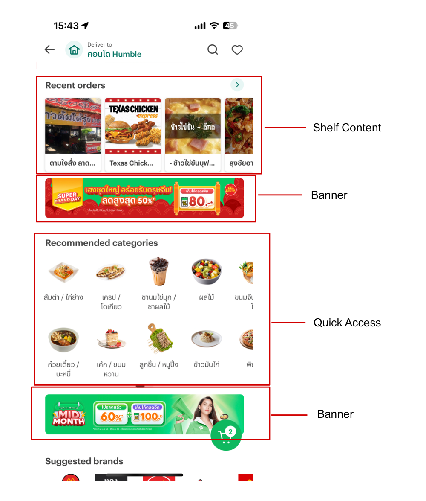

# SOURCE/OUTPUT JSON

### Default field

| Field                   | Mendatory |                                      Description                                       |
| ----------------------- | :-------: | :------------------------------------------------------------------------------------: |
| id                      |     Y     |                                  The ID of each item                                   |
| viewType                |     Y     | Component view type [Banner, Quick Access, Shelf Content, Search Bar, Feed Content...] |
| attributes              |     Y     |                The field is used to define the style of the component.                 |
| attributes.heightPolicy |     Y     |                           View height type [ fixed , ratio ]                           |
| attributes.heightValue  |     Y     |                             View height value [50, "16:9"]                             |
| parameters              |           |                         The field is used to display directly.                         |
| payload                 |           |   Data payloads that may need to be resolved (can be known by type static or remote)   |

## Example

[Specification](../example/spec/)
[JSON Source/Output](../example/source.json)

