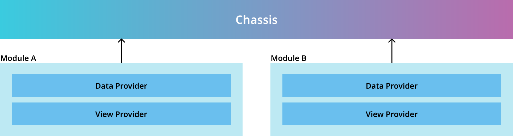
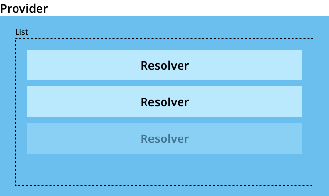
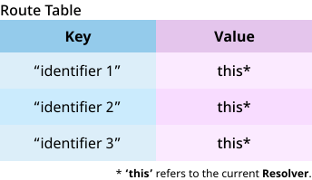

# Chassis' Provider (v2)

**A scalable** ``Provider`` concept by using code generator.

---

## Installation

Add these dependencies to your module ``pubspec.yaml``.

``` yaml
dependencies:
  chassis_annotation:
    path: ../annotation

dev_dependencies:
  build_runner: ^2.3.3
  chassis_generator:
    path: ../generator
```

### Examples

In example, we will provide a implementation in 2 sections

- [DataProvider](/flutter_chassis/examples/provider/v2/document/data_provider/README.md)
- ViewProvider (In progress)

---

## Overview

Nowadays, most of applications are using modulization to scale their application. We are trying to improve our providers to be more flexible and scalable for a large project usecase.
  
then we came out with the concept...

" **more flexibility** but **less complexity**. "

</br>
</br>
</br>

``Chassis`` will be able to use in core module, by just one instance, then we can consider to import our providers and add them to ``Chassis``.

Also, you can use ``Chassis`` for more instances in each module by implementing on their own.
</br>

### Components

#### Provider

In ``Chassis``' provider concept, there are two types of providers, ``DataProvider`` and ``ViewProvider``, and a module can have only one of each types.

</br>

To make our providers to be more flexable and scalable, we decided to create a new component called **Resolver**.
</br>

#### Resolver

A component that will let providers to be able to scale their size, handling the requests from ``Chassis`` to get what is it looking for.
</br>

</br>

A ``Provider`` can also have **one or many resolver**, depends on your consideration, but we sugguest you to have multiple resolvers in your provider for more manageable.
</br>

#### Route Table

A ``Map`` of identifier ``String`` (Key), and its component (Value) including ``Provider`` and ``Resolver``. This table will simplify a complexity of the communication between provider and its resolvers.

</br>

A table will be created by ``Resolver`` and will be shared with its ``Provider`` when it has registed.
